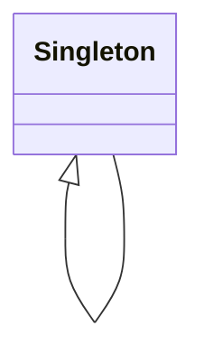

# 单例模式 (Singleton)

## 定义

保证一个类只有一个实例，并提供一个全局访问点。

## 原理

单例模式的核心思想是通过某种方式控制类的实例化过程，使得在程序的整个生命周期内，该类只能创建并保留一个实例对象。

实现原理：
1. **私有化构造函数**：阻止外部通过 `new` 创建实例
2. **类变量保存实例**：使用类属性存储唯一实例
3. **静态方法获取实例**：通过类方法获取全局唯一实例

## UML 图



## 角色

| 角色 | 职责 |
|------|------|
| Singleton | 单例类，负责创建并保存唯一实例，提供全局访问点 |

## 优点

1. **全局唯一访问点**：在整个系统中只需要一个实例，避免了重复创建资源
2. **减少内存开销**：只创建一个实例，减少内存占用
3. **便于管理**：集中管理全局状态和共享资源

## 缺点

1. **违反单一职责**：单例类既要负责业务逻辑，又要控制实例创建
2. **全局状态**：单例对象携带的全局状态可能被意外修改，导致难以调试
3. **线程安全问题**：在多线程环境下需要考虑同步问题
4. **难以测试**：单例的全局特性使得单元测试困难

## 适用场景

1. **配置管理器**：全局配置信息只需要一份
2. **数据库连接池**：数据库连接只需要一个实例
3. **日志记录器**：整个应用共享一个日志实例
4. **线程池**：线程资源需要统一管理
5. **缓存对象**：全局缓存只需要一个实例

## 代码示例

### 入门级

最基础的实现，展示单例模式的核心原理。

[代码案例](./01_beginner.py)

### 简单级

完整的实现，添加了基本的说明注释。

[代码案例](./02_simple.py)

### 中级

结合实际场景，展示配置管理器的应用。

[代码案例](./03_intermediate.py)

### 高级

生产级实现，包含线程安全、序列化支持、防止反射攻击。

[代码案例](./04_advanced.py)

## Python 特色

### 1. 模块即单例

在 Python 中，每个模块文件本身就是天然的单例。因为模块只会被导入一次，后续导入都会返回同一个对象。

```python
# config.py
class Config:
    pass

config = Config()  # 模块级实例，整个程序只有一个

# 其他文件导入时，获得的是同一个实例
from config import config
```

### 2. `__new__` 方法

Python 中通过重写 `__new__` 方法来控制实例创建，这是实现单例的标准方式。

### 3. 装饰器实现

可以使用装饰器将任意类转换为单例类，这是 Python 特有的简洁写法。

### 4. 元类方案

通过元类（metaclass）可以在类定义层面实现单例，这是最 Pythonic 的方式。

## 实际应用

### 标准库中的使用

- `logging.getLogger()`：日志记录器采用单例模式
- `threading.Lock()`：线程锁对象
- `sys.modules`：已导入的模块缓存

### 框架中的使用

- **Flask**：应用对象 `app` 是单例
- **Django**：WSGI handler 是单例
- **TensorFlow**：计算图是单例

## 相关模式

- **工厂方法**：常与单例结合，工厂类可以是单例
- **原型模式**：单例可以配合原型实现克隆
- **享元模式**：两者都是共享对象，但目的不同

---
