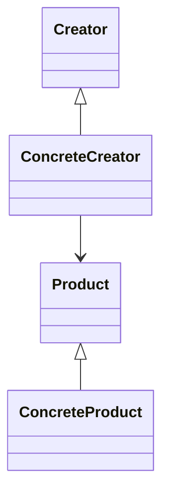

# 工厂方法模式 (Factory Method)

## 定义

定义创建对象的接口，由子类决定实例化哪个类。工厂方法让类把实例化推迟到子类。

## 原理

工厂方法模式的核心思想是将对象的创建逻辑封装到子类中，由子类决定创建具体的产品对象。

实现原理：
1. **定义产品抽象类**：规定产品的统一接口
2. **定义工厂抽象类**：声明创建产品的抽象方法
3. **具体产品实现**：实现产品接口的具体类
4. **具体工厂实现**：实现创建产品的方法

## UML 图

## 角色

| 角色 | 职责 |
|------|------|
| Product | 产品抽象类，定义产品的统一接口 |
| ConcreteProduct | 具体产品类，实现产品接口 |
| Creator | 创建者抽象类，声明工厂方法 |
| ConcreteCreator | 具体创建者，实现工厂方法创建产品 |

## 优点

1. **开闭原则**：新增产品只需添加新的具体工厂类，无需修改现有代码
2. **解耦**：客户端代码与具体产品类解耦
3. **子类替代**：子类可以替换父类的行为
4. **代码结构清晰**：创建逻辑集中在工厂类中

## 缺点

1. **类的数量增加**：每增加一个产品就需要增加一个具体工厂类
2. **增加了复杂度**：引入了抽象层，增加了系统复杂度

## 适用场景

1. **对象创建逻辑可能变化**：需要灵活扩展产品类型
2. **不想让客户端知道具体产品类**：隐藏产品创建细节
3. **创建过程复杂**：需要统一管理对象创建流程

## 代码示例

### 入门级

最基础的实现，展示工厂方法的核心原理。

[代码案例](./01_beginner.py)

### 简单级

完整的实现，展示动物工厂的例子。

[代码案例](./02_simple.py)

### 中级

结合实际场景，展示简单计算器的应用。

[代码案例](./03_intermediate.py)

### 高级

生产级实现，展示物流系统中的应用。

[代码案例](./04_advanced.py)

## Python 特色

### 1. 简单函数替代类

在 Python 中，工厂方法可以用简单的工厂函数实现，不需要定义完整的工厂类。

### 2. 类方法作为工厂

可以使用 `@classmethod` 将类方法作为工厂方法。

### 3. __call__ 方法

可以通过实现 `__call__` 方法让类可调用，作为工厂。

## 实际应用

### 标准库中的使用

- `collections.defaultdict`：工厂函数
- `json.JSONDecoder`：工厂类

### 框架中的使用

- **Django**：ModelForm 工厂
- **SQLAlchemy**：ORM 对象创建

## 相关模式

- **抽象工厂**：工厂方法的抽象，常一起使用
- **模板方法**：工厂方法常作为模板方法的一部分
- **原型模式**：可以替代工厂方法

---
