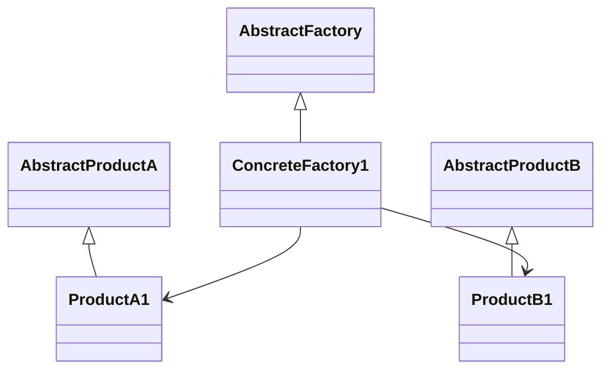

# 抽象工厂模式 (Abstract Factory)

## 定义

提供一个创建一系列相关对象的接口，无需指定具体类。抽象工厂允许客户使用抽象的接口来创建一组相关的产品，而不需要知道具体产出的产品是什么。

## 原理

抽象工厂模式的核心思想是将一系列相关产品封装到一个工厂类中，客户通过抽象接口操作产品，而不需要知道具体是哪个工厂生产的。

实现原理：
1. **抽象产品**：定义产品接口
2. **具体产品**：实现产品接口
3. **抽象工厂**：声明创建一系列产品的方法
4. **具体工厂**：实现创建具体产品的方法

## UML 图

## 角色

| 角色 | 职责 |
|------|------|
| AbstractFactory | 抽象工厂，声明创建一系列产品的接口 |
| ConcreteFactory | 具体工厂，实现创建具体产品的方法 |
| AbstractProduct | 抽象产品，定义产品接口 |
| ConcreteProduct | 具体产品，实现抽象产品接口 |

## 优点

1. **产品一致性**：确保一系列产品相互配套
2. **解耦**：客户端与具体产品解耦
3. **易于交换产品族**：只需更换具体工厂即可切换产品族
4. **符合开闭原则**：新增产品族只需添加新工厂

## 缺点

1. **增加复杂度**：需要定义多个抽象产品和工厂
2. **难以支持新产品**：抽象工厂难以支持新产品结构的扩展

## 适用场景

1. **产品族需要一致**：系统需要一组相关产品协同工作
2. **切换产品族**：需要动态切换产品族
3. **不想暴露产品创建细节**：隐藏具体产品创建逻辑

## 代码示例

### 入门级

最基础的实现，展示抽象工厂的核心原理。

[代码案例](./01_beginner.py)

### 简单级

完整的实现，展示 UI 组件工厂的例子。

[代码案例](./02_simple.py)

### 中级

结合实际场景，展示跨平台 UI 组件的应用。

[代码案例](./03_intermediate.py)

### 高级

生产级实现，展示游戏开发中的应用。

[代码案例](./04_advanced.py)

## Python 特色

### 1. 简单函数替代

可以使用简单的工厂函数代替抽象工厂类。

### 2. 字典映射

可以使用字典实现工厂映射。

## 实际应用

### 框架中的使用

- **Tkinter/Qt**：跨平台 UI 组件
- **SQLAlchemy**：数据库抽象层
- **Django ORM**：跨数据库支持

## 相关模式

- **工厂方法**：抽象工厂通常用工厂方法实现
- **单例**：具体工厂通常实现为单例
- **原型**：可以用原型模式创建产品

---
