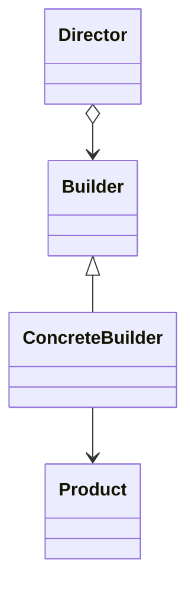

# 建造者模式 (Builder)

## 定义

将一个复杂对象的构建与它的表示分离，使得同样的构建过程可以创建不同的表示。

## 原理

建造者模式的核心思想是将复杂对象的构建过程分解为多个步骤，通过不同的 builder 实现不同的表示。

## UML 图

## 角色

| 角色 | 职责 |
|------|------|
| Builder | 抽象建造者，定义创建产品各部件的接口 |
| ConcreteBuilder | 具体建造者，实现各部件的创建 |
| Director | 指挥者，构建一个使用 Builder 接口的对象 |
| Product | 产品角色 |

## 优点

1. **封装性**：建造过程封装在 builder 中
2. **可独立变化**：可以独立地变化产品的表示
3. **精细控制**：精细控制构建过程

## 缺点

1. **类数量增加**：需要创建多个 builder 类
2. **复杂性增加**：增加了系统复杂度

## 适用场景

1. **对象构造复杂**：包含多个可选参数
2. **需要创建不同表示**：同一构建过程创建不同产品

## 代码示例

### 入门级

[代码案例](./01_beginner.py)

### 简单级

[代码案例](./02_simple.py)

### 中级

[代码案例](./03_intermediate.py)

### 高级

[代码案例](./04_advanced.py)

## Python 特色

### 链式调用

Python 中常用链式调用实现 builder 模式。

## 实际应用

- **pandas**：DataFrame 构建
- **requests**：Request 对象构建

## 相关模式

- **抽象工厂**：两者都用于创建复杂对象
- **组合模式**：常一起使用

---
