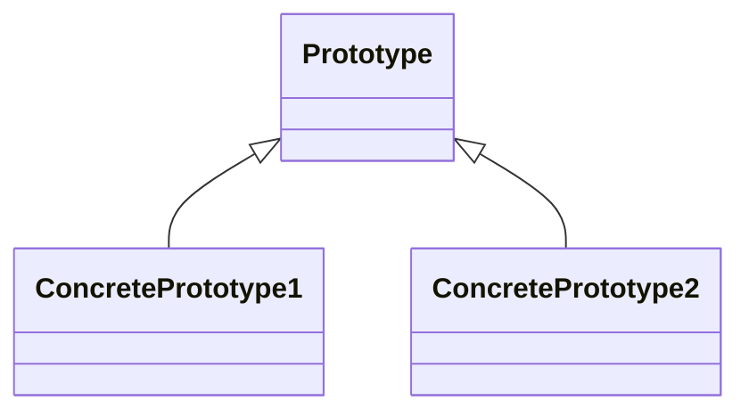

# 原型模式 (Prototype)

## 定义

用原型实例指定创建对象的种类，通过复制原型创建新对象。

## 原理

原型模式的核心思想是通过复制已有对象来创建新对象，而不是通过构造函数。

## UML 图

## 角色

| 角色 | 职责 |
|------|------|
| Prototype | 抽象原型类，声明克隆方法 |
| ConcretePrototype | 具体原型类，实现克隆方法 |

## 优点

1. **减少对象创建成本**：复制比创建更快
2. **简化创建过程**：无需知道具体类名
3. **扩展性高**：新增原型不影响原有代码

## 缺点

1. **深浅拷贝问题**：需要处理引用类型拷贝
2. **类的数量增加**：每个类都需要实现克隆方法

## 适用场景

1. **创建对象成本高**：如复杂对象、数据库连接
2. **避免继承创建对象**：通过复制已有对象创建
3. **相同对象多次创建**：需要创建多个相似对象

## 代码示例

### 入门级

[代码案例](./01_beginner.py)

### 简单级

[代码案例](./02_simple.py)

### 中级

[代码案例](./03_intermediate.py)

### 高级

[代码案例](./04_advanced.py)

## Python 特色

### copy 模块

Python 提供 `copy.copy()` 浅拷贝和 `copy.deepcopy()` 深拷贝。

## 实际应用

- **原型工厂**：批量创建相似对象
- **游戏对象**：复制游戏角色

## 相关模式

- **工厂方法**：与原型结合使用
- **备忘录**：保存状态用于恢复

---
